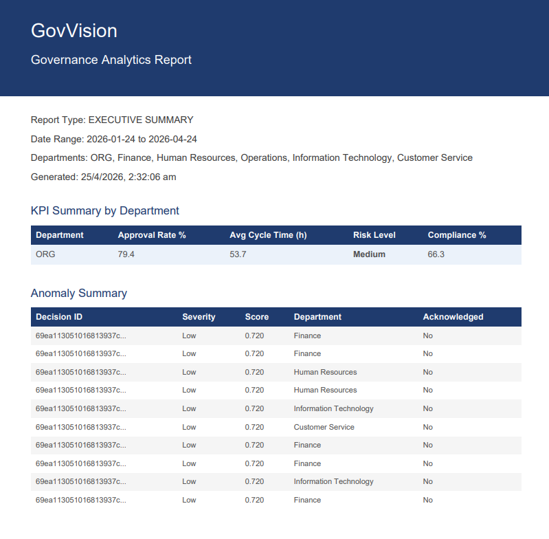

<div align="center">
  <h1>🏛️ Gov Vision</h1>
  <p><strong>A Comprehensive Platform for Government Analytics, Risk Scoring, and AI-Driven Forecasting</strong></p>
</div>

<br />

## 📖 Introduction
**Gov Vision** is an advanced, full-stack application tailored for enterprise and government analytics. It integrates real-time event tracking, AI-powered anomaly detection, predictive forecasting, and automated risk scoring to deliver actionable insights. With a modern React frontend and a robust microservices backend (Node.js & Python ML), Gov Vision ensures high performance, scalability, and security to facilitate data-driven decision-making.

---

## ✨ Features
- **📊 Real-time Analytics Dashboard**: Interactive charts and rich data visualizations using Recharts and ECharts.
- **🤖 AI-Powered Insights**: Dedicated Machine Learning microservice for anomaly detection, risk scoring, and time-series forecasting (using Prophet & Scikit-Learn).
- **⚙️ Automated Jobs**: Scheduled background processes for report generation, model retraining, and scheduled risk assessments using `node-cron`.
- **🔐 Secure Authentication**: Robust Role-Based Access Control (RBAC), JWT authentication, and secure API rate limiting.
- **📄 Report Generation**: Automated generation and export of comprehensive PDF and CSV reports for compliance and auditing.
- **🚀 High Performance & Scalability**: Multi-service architecture leveraging Redis caching for fast data retrieval and MongoDB for flexible data storage.

---

## 📸 Screenshots

Here is a glimpse of Gov Vision in action:

| Dashboard | Decision Analytics |
| :---: | :---: |
|  |  |

| Decision Details | Compliance |
| :---: | :---: |
|  |  |

| Department Performance | Anomaly Detection 1 |
| :---: | :---: |
|  |  |

| Anomaly Detection 2 | Anomaly Detection 3 |
| :---: | :---: |
|  |  |

| Forecast | Delay Forecast |
| :---: | :---: |
|  |  |

| Risk Scoring | Risk Features |
| :---: | :---: |
|  |  |

| Report Builder 1 | Report Builder 2 |
| :---: | :---: |
|  |  |

| Report Builder 3 | Report Builder 4 |
| :---: | :---: |
|  |  |

| Additional View 1 | Additional View 2 |
| :---: | :---: |
|  |  |

---

## 🛠️ Tech Stack & Libraries

We built Gov Vision using modern, reliable technologies and libraries to ensure an optimal developer and user experience.

### 💻 Frontend (Client)
<p>
  
  
  
  
</p>

* **Core**: React 19, TypeScript, Vite
* **Styling**: Tailwind CSS, PostCSS, clsx
* **Routing & State**: React Router DOM
* **Visualization**: ECharts, Recharts
* **Utilities**: Axios, HTML2Canvas, React Datepicker

### 🗄️ Backend (Node.js Server)
<p>
  
  
  
  
</p>

* **Core**: Node.js, Express, TypeScript
* **Database & Caching**: MongoDB (Mongoose), Redis (ioredis)
* **Security**: JWT (jsonwebtoken), bcrypt, Helmet, CORS, Express Rate Limit
* **Utilities**: Node-cron (task scheduling), Nodemailer, Morgan (logging)
* **Reporting**: ExcelJS, jsPDF, json2csv

### 🧠 Machine Learning Service (Python)
<p>
  
  
  
  
</p>

* **Core**: Python 3, FastAPI, Uvicorn
* **Data Science**: Scikit-Learn, Pandas, NumPy
* **Forecasting**: Prophet
* **Utilities**: Joblib, PyMongo, Python-dotenv

---

## 🏗️ Project Structure

```text
gov_vision/
├── client/         # React 19 Frontend application
├── server/         # Node.js/Express Backend API server
├── ml_service/     # Python/FastAPI Machine Learning service
├── contracts/      # Smart contracts (Blockchain integration)
├── config/         # Shared configuration files
└── documentation/  # Additional project documentation
```

---

## 🚦 Getting Started

### Prerequisites
- [Node.js](https://nodejs.org/) (v18 or higher recommended)
- [Python](https://www.python.org/) (v3.9 or higher)
- [MongoDB](https://www.mongodb.com/) & [Redis](https://redis.io/)

### 1. Clone the repository
```bash
git clone https://github.com/your-username/gov-vision.git
cd gov-vision
```

### 2. Start the Backend Server
```bash
cd server
npm install
npm run dev
```

### 3. Start the ML Service
```bash
cd ml_service
pip install -r requirements.txt
uvicorn main:app --reload
```

### 4. Start the Client
```bash
cd client
npm install
npm run dev
```

---

